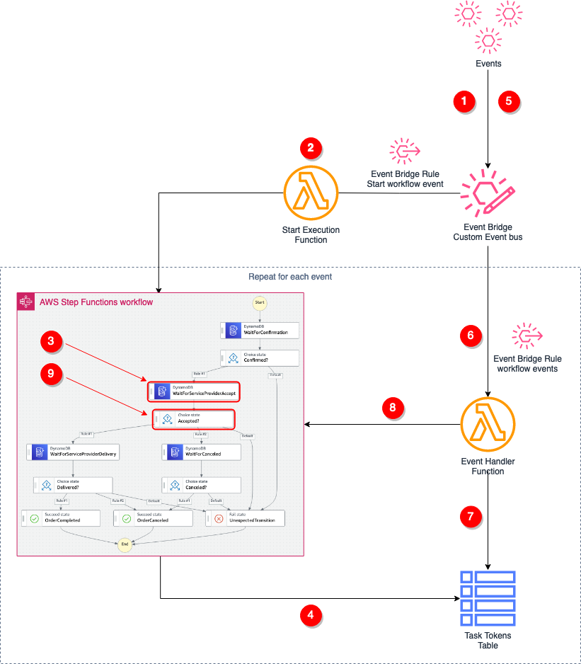
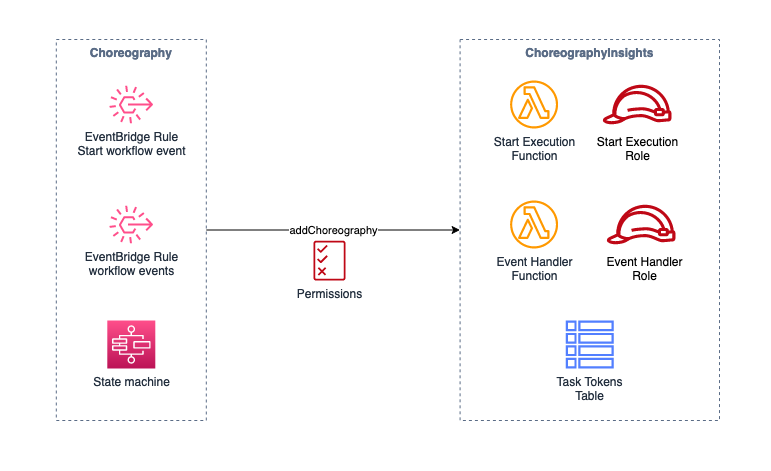
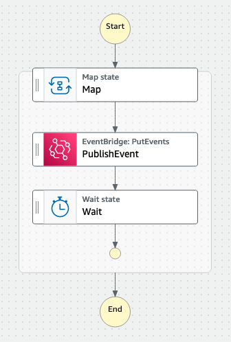

# Choreography Insights with AWS Step Functions

This is a sample project to showcase how to leverage AWS Step Functions to formally define a service choreography as a state machine and quickly gain visual insights of executions from the AWS Step Functions console.

The project uses AWS CDK to create Constructs that facilitate the provisioning of resources and reduce development effort in defining choreographies' state machines.

## Requirements

1. An [AWS Account](https://portal.aws.amazon.com/gp/aws/developer/registration/index.html)
2. [AWS CLI v2.1.35 installed](https://docs.aws.amazon.com/cli/latest/userguide/cli-chap-install.html) and [configured](https://docs.aws.amazon.com/cli/latest/userguide/cli-chap-configure.html) with Admin privileges
3. [AWS CDK v1.128.0 installed](https://docs.aws.amazon.com/cdk/latest/guide/getting_started.html#getting_started_install)
4. [NodeJS v12.x installed](https://nodejs.org/en/download/package-manager/)

## Quickstart Installation
This repository already contains CDK stack `ChoreographyInsightsStack` with necessary configuration to provision resources for monitoring choreographies. It also provision a state machine to execute workflow simulation ([WorkflowSimulationStateMachine](#workflowsimulationstatemachine)) and  2 state machines modeling demo choreographies:
- A marketplace order workflow
- A second hand car dealer workflow

### Build and deploy
1. Run `npm install`
2. Run `cdk deploy`


## How to use constructs
1. Initialize the [ChoreographyInsights](#choreographyinsights) construct to provision AWS resources used to interact with the event bus and state machines to start, pause and resume executions
    ```ts
    const insights = new ChoreographyInsights(this, "Choreography");
    ```
2. Model an events' choreography as a Step Functions state machine definition using [ChoreographyState](#choreographystate) and [ChoreographyStateBuilder](#choreographystatebuilder) constructs. See [How to model a choreography](#how-to-model-a-choreography-as-a-step-functions-state-machine-definition) for more details.
3. Use [Choreography](#choreography) construct to configure which events trigger the start of execution and other transitions
   ```ts
    //Define the choreography binding, passing the state machine definition, start event pattern and other events patterns to capture
    const orderChoreography = new Choreography(this, "Order", {
      definition: orderWorkflow,
      startEvent: {
        pattern: { source: ["order"], detailType: ["Order Placed"] }
      },
      events: [{
        pattern: { source: ["order"], detailType: [ { "anything-but": "Order Placed"} ] as any[] }
      }]
    });
    ```
4. Bind the `Choreography` instance to `ChoreographyInsights`. This will add the necessary permission to allow the two constructs to use each other resources. For more information, see [ChoreographyInsights](#choreographyinsights)
    ```ts
    //Bind the choreography to the 'ChoreographyInsights' construct
    insights.addChoreography(orderChoreography);
    ```

Here is the architecture overview:


## How to model a choreography as a Step Functions state machine definition
You can use [ChoreographyState](#choreographystate) and [ChoreographyStateBuilder](#choreographystatebuilder) constructs to model choreography as a Step Functions state machine.

`ChoreographyState` construct simplifies the definition of Step Functions task states that model process states by extending CallAWSService construct and encapsulating the configuration required to use waitForCallback pattern and store the task token to DynamoDB.
Using ChoreographyState objects and other Step Functions states such as Choice, Parallel, Fail, Success you have enough flexibility to model workflows as Step Functions state machine definitions (IChainable).

`ChoreographyStateBuilder` construct facilitate the creation of ChoreographyState objects. You only need to specify the DynamoDB Table which is used to manage Task Tokens reads and writes.

Here is an example for a marketplace order processing workflow: 
```ts
//Provision resources to control the state machine execution start and transitions
const insights = new ChoreographyInsights(this, "Choreography");

//Builder class to use to create States that model the business workflow
const builder = new ChoreographyStateBuilder(this, "Builder", {
  taskTokenTable: insights.taskTokensTable
});

//Workflow definition as a state machine, using the builder to create individual states
const waitForConfirmation = builder.withName("WaitForConfirmation").build();
const waitForServiceProviderToAccept = builder.withName("WaitForServiceProviderAccept").build();
const waitForServiceProviderDelivery = builder.withName("WaitForServiceProviderDelivery").build();
const waitForCanceled = builder.withName("WaitForCanceled").build();

const orderCanceled = new Succeed(this, "OrderCanceled");
const orderCompleted = new Succeed(this, "OrderCompleted");
const unexpectedTransition = new Fail(this, "UnexpectedTransition");

const deliveryChoice = new Choice(this, "Delivered?")
  .when(Condition.stringEquals("$.eventName", "Order Delivered"), orderCompleted)
  .when(Condition.stringEquals("$.eventName", "Order Canceled"), orderCanceled)
  .otherwise(unexpectedTransition);

const orderAcceptedBranch = waitForServiceProviderDelivery.next(deliveryChoice);

const orderRejectedBranch = waitForCanceled
  .next(new Choice(this, "Canceled?")
  .when(Condition.stringEquals("$.eventName", "Order Canceled"), orderCanceled)
  .otherwise(unexpectedTransition));

const workflowDefinition = waitForConfirmation
  .next(new Choice(this, "Confirmed?")
    .when(Condition.stringEquals("$.eventName", "Order Confirmed"),
      waitForServiceProviderToAccept
      .next(new Choice(this, "Accepted?")
        .when(Condition.stringEquals("$.eventName", "Order Accepted"), orderAcceptedBranch)
        .when(Condition.stringEquals("$.eventName", "Order Rejected"), orderRejectedBranch)
        .otherwise(unexpectedTransition)))
    .otherwise(unexpectedTransition)
  );
```
# Constructs
This project includes CDK constructs you can use to quickly model choreographies as AWS Step Functions state machines.

`ChoreographyInsights` and `Choreography` constructs provision AWS resources. The following diagram provides an overview of the provisioned resources. 


`ChoreographyState` and `ChoreographyStateBuilder` constructs make it easier to define choreographies as state machines by encapsulating the necessary underlying configurations. See [How to model a choreography](#how-to-model-a-choreography-as-a-step-functions-state-machine-definition)
## ChoreographyInsights
This construct provisions AWS resources to intercept events from a central event bus and interact with Step Functions state machines that model choreographies (see Choreography construct).
Here is the list of provisioned resources:
- A DynamoDB Table storing Step Functions Task tokens
- A Lambda function that starts a new execution of state machines representing choreographies (see Choreography construct)
- A Lambda function that handles events published to the configured event bus. The function retrieves existing task tokens by execution id and call SendTaskSuccess API against Step Functions using that token to resume execution

### Initialization
```ts
const insights = new ChoreographyInsights(this, "Choreography");
```
Optionally it is possible to specify a custom `EventBus`
```ts
const myBus = new EventBus(this, "MyEventBus");
    
const insights = new ChoreographyInsights(this, "Choreography", { eventBus: myBus });
```
### Choreography binding
Once you instantiate a [Choreography](#choreography), you can add it to `ChoreographyInsights` using the following
```ts
insights.addChoreography(orderChoreography);
```
This provides additional configuration for `ChoreographyInsights`' Lambda functions permissions. Specifically it:
- adds Resource-based policies that allow EventBridge rules from the `Choreography` to trigger those functions.
- adds permissions to those functions' execution roles to interact with the Step Functions state machine 

## ChoreographyState
This construct extends [CallAwsService](https://docs.aws.amazon.com/cdk/api/latest/docs/@aws-cdk_aws-stepfunctions-tasks.CallAwsService.html) construct and encapsulate the configuration needed to create a waitForCallback task which store the Task Token to the DynamoDB Table provisioned from the `ChoreographyInsights`.
It requires 3 properties:
1. `name` - The name of the state
2. `entityId` - The path in the expected event payload where to find the choreography correlation id. By default this is `$$.Execution.Input.detail.id`
3. `eventName` - The type of expected event (detail-type field of EventBridge event format)

## ChoreographyStateBuilder
This construct facilitates the creation of Step Functions task states that comply with the ChoreographyInsights architecture.

### Initialization
You initialize the builder passing the DynamoDB Table provisioned by `ChoreographyInsights`.
```ts
const builder = new ChoreographyStateBuilder(this, "Builder", {
  taskTokenTable: insights.taskTokensTable
});
```
You can optionally specify at the builder level which JSON Path to use to retrieve the choreography identifier from events' payloads. By default this is `$$.Execution.Input.detail.id`
```ts
const builder = new ChoreographyStateBuilder(this, "Builder", {
  taskTokenTable: insights.taskTokensTable,
  entityId: JsonPath.stringAt("$$.Execution.Input.order-id")
});
```
### Usage
Once initialized, the Builder can be used to quickly create `ChoreographyState` instances to use in the choreography definition.
The Builder provides a fluid API to specify the `name` of the state, the path where to find the choreography id (`entityId`) and, optionally, the type of the event which is expected when in that particular state (`eventName`).
```ts
/**
 * This will create a state named 'WaitForConfirmation'.
 * It will use the default json path to find the choreography id and
 * won't expect any particular event for the next transition
 */
const simpleState = builder.withName("WaitForConfirmation").build();

/**
 * This will create a state named 'Clean'.
 * It expects a 'Car Cleaned' event to transition to next state.
 * It uses the default json path to find the choreography id
 */
const stateWithEventName = builder.withName("Clean").withEventName("Car Cleaned").build()
```
## Choreography
This construct encapsulates the binding configuration between a choreography state machine and the ChoreographyInsights resources.

It requires the following configuration:
1. A state machine definition (IChainable)
2. An `EventPattern` to match the event that should start a new execution
3. A list of `EventPattern` to match events that trigger state machine transitions.

```ts
const orderChoreography = new Choreography(this, "Order", {
  definition: orderWorkflow,
  startEvent: {
    pattern: { source: ["order"], detailType: ["Order Placed"] }
  },
  events: [{
    pattern: { source: ["order"], detailType: [ { "anything-but": "Order Placed"} ] as any[] }
  }]
});
  ```

> IMPORTANT: The construct validates the state function definition, making sure that only allowed states are added. You can use all type of states available in Step Functions with the only constraint that Task states should be instances of `ChoreographyState`.
## WorkflowSimulationStateMachine
This is a convenient Construct that enables to run simulations for testing purposes. It provision a Step Functions workflow that publish a sequence of events, which you can specify as input, to a specified event bus.



You simply add this to your stack
```ts
//Workflow simulation
new WorkflowSimulationStateMachine(this, "WorkflowSilumation", { eventBus: eventBus });
```

You can see you need to specify an event bus where to publish events.

Then you can simulate a workflow by starting a new execution

```console
foo@bar:~$ aws stepfunctions start-execution --state-machine-arn arn:aws:states:<region>:<accountId>:stateMachine:<workflowId> --input file://test.json
```

providing as input a JSON structure similar to the following:
```json
{
  "events": [
    {
      "source": "car",
      "detailType": "Car Announced",
      "detail": {
        "id": "car-88888"
      },
      "wait": "5"
    },
    {
      "source": "car",
      "detailType": "Inspection Completed",
      "detail": {
        "id": "car-88888",
        "result": "Success"
      },
      "wait": "5"
    },
    {
      "source": "car",
      "detailType": "Car Cleaned",
      "detail": {
        "id": "car-88888"
      },
      "wait": "5"
    },
    {
      "source": "car",
      "detailType": "Car Priced",
      "detail": {
        "id": "car-88888",
        "price": {
          "amount": 10000,
          "currency": "EUR"
        }
      },
      "wait": "2"
    },
    {
      "source": "car",
      "detailType": "Car Repaired",
      "detail": {
        "id": "car-88888",
        "cost": {
          "amount": 1250,
          "currency": "EUR"
        }
      },
      "wait": "2"
    },
    {
      "source": "car",
      "detailType": "Car Published",
      "detail": {
        "id": "car-88888",
        "channels": ["b2b", "b2c"]
      },
      "wait": "10"
    },
    {
      "source": "car",
      "detailType": "Car Reserved",
      "detail": {
        "id": "car-88888",
        "customer": {
          "id": "kdjfniwyf8sbfdjsh"
        }
      },
      "wait": "5"
    },
    {
      "source": "car",
      "detailType": "Car Sold",
      "detail": {
        "id": "car-88888"
      },
      "wait": "5"
    },
    {
      "source": "car",
      "detailType": "Car Delivered",
      "detail": {
        "id": "car-88888",
        "delivery": {
          "id": "JJJFEWN833NNKLSDHJ",
          "date": "29-10-2021",
          "time": "15:15"
        }
      },
      "wait": "5"
    },
    {
      "source": "car",
      "detailType": "Invoice Sent",
      "detail": {
        "id": "car-88888",
        "invoice": {
          "id": "1235627429085789"
        },
        "customer": {
          "id": "kdjfniwyf8sbfdjsh"
        }
      },
      "wait": "2"
    }
  ]
}
```
## Useful commands

 * `npm run build`   compile typescript to js
 * `npm run watch`   watch for changes and compile
 * `npm run test`    perform the jest unit tests
 * `cdk deploy`      deploy this stack to your default AWS account/region
 * `cdk diff`        compare deployed stack with current state
 * `cdk synth`       emits the synthesized CloudFormation template
